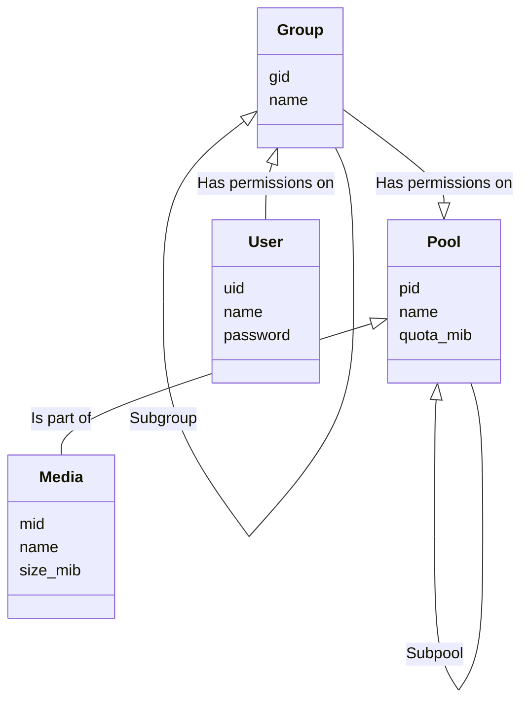

# Velocity API specification `v 1.0`

This is the `1.0` version of the Velocity API specification.

The Velocity API uses `JSON` as its language.

### Hierarchy

Velocity manages virtual machines and resources seperately.

For resources, velocity uses so-called "pools" and virtual machines are managed in "catalogs".

The API is divided into several namespaces:

- [`/u`](./APISPEC/u.md): User and group management
- [`/m`](./APISPEC/m.md): Pool and media management
- [`/v`](./APISPEC/v.md): Virtual machine management

### Authentication

Velocity handles authentication using the `Bearer` authentication method with the token being aliased as the `Authkey`.

Refer to the [Vapor manual](https://docs.vapor.codes/security/authentication/#bearer) for more information.

### Errors

If the API enconters some kind of error, it will respond with a http-response code in a non-200 range and an error as follows:

```json
{
  "code": "<Error code>",
  "message": "<Some error message (optional)>"
}
```

Some additional fields may be added to the error response depending on calls but this layout is guaranteed.

For an exhaustive list of available error codes, refer to the [ERRORS](./APISPEC/errors.md) article.

Some http-response codes are fixed:

- `400 - Bad Request`: The request is missing fields

- `401 - Unauthorized`: The request is missing the `authkey` for privileged actions

- `500 - Internal Server Error`: The server encountered an error while processing the request

# Entity hierarchy

Velocity's main work horse are groups. Each Virtual machine is owned by a group, wich is owned by another parent group. All the way up to the `root` group (`0`).

Each user can be assigned to a group with permissions. These permissions for groups persist for all subgroups. This allows a user that has a permission in a parent group to use it in subgroups. This allows for building a structured and manageable entity and user tree.

For permissions, read the [PERMISSIONS](./APISPEC/permissions.md) article.


